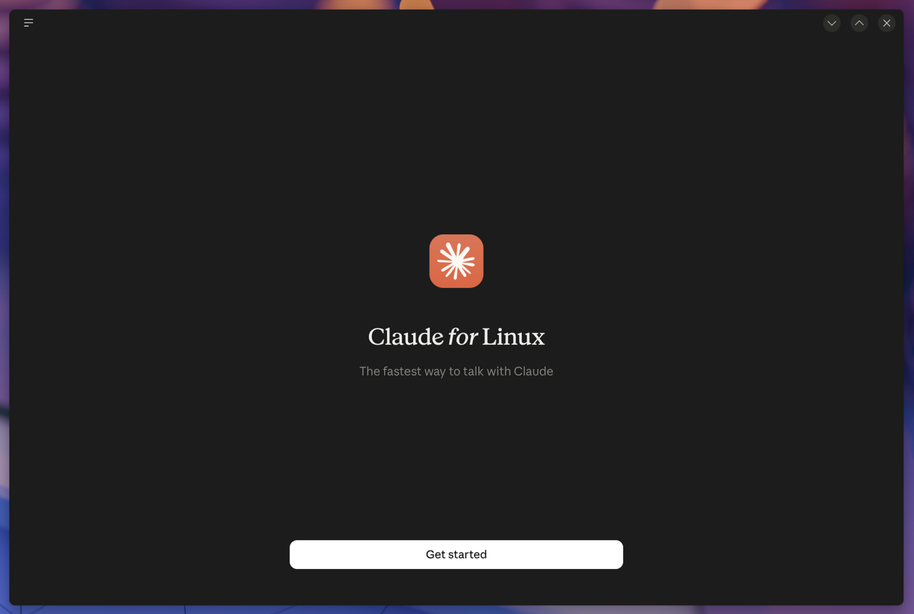

# claude-desktop-nixos



Nix packaging and a NixOS module for [Claude Desktop on Linux (beta)](https://code.claude.com/docs/en/desktop-linux)
— Chat, Cowork and Claude Code in one app.

Anthropic publishes the app only as a Debian package. This repo repackages the
official `.deb` from `downloads.claude.ai` (no rebuild; the bundled Electron is
kept and patched with `autoPatchelfHook`) and sets up what Cowork's QEMU/KVM
virtual machine needs on NixOS.

The MIT license covers the Nix code in this repo only. Claude Desktop itself is
proprietary (`meta.license = unfree`).

Supported: `x86_64-linux`, `aarch64-linux`.

## Usage

### NixOS, flakes

```nix
{
  inputs.claude-desktop.url = "github:kubastick/claude-desktop-nixos";

  outputs = { nixpkgs, claude-desktop, ... }: {
    nixosConfigurations.myhost = nixpkgs.lib.nixosSystem {
      modules = [
        claude-desktop.nixosModules.default
        {
          nixpkgs.config.allowUnfree = true;
          programs.claude-desktop = {
            enable = true;
            cowork.users = [ "alice" ];
          };
        }
      ];
    };
  };
}
```

### NixOS, channels

```nix
let
  claude-desktop-nixos = builtins.fetchTarball {
    url = "https://github.com/kubastick/claude-desktop-nixos/archive/<rev-or-tag>.tar.gz";
    sha256 = "<hash>";
  };
in
{
  imports = [ "${claude-desktop-nixos}/module.nix" ];
  nixpkgs.config.allowUnfree = true;
  programs.claude-desktop = {
    enable = true;
    cowork.users = [ "alice" ];
  };
}
```

### Package only (home-manager, `nix profile`, other distros)

- Flake: `packages.<system>.claude-desktop`, or `overlays.default` to get `pkgs.claude-desktop`.
- Without flakes: `pkgs.callPackage "${src}/package.nix" { }` or `nix-build` in this repo.

Cowork also needs the host setup that the module does (see below), so on its
own the package gives you Chat and Claude Code.

### Try it without installing

Run the app straight from the Nix store; nothing is added to your profile or
system config:

```sh
# flakes
nix run github:kubastick/claude-desktop-nixos

# from a local checkout, without flakes
nix-build && ./result/bin/claude-desktop
```

Chat and Claude Code work this way. Cowork also needs the host setup the module
provides (see below). The app keeps its data in `~/.config/Claude` and your
keyring, so delete those if you're only trying it out.

## Options

| Option | Default | Description |
| --- | --- | --- |
| `programs.claude-desktop.enable` | `false` | Install the app (desktop entry, `claude://` handler, MIME types, GNOME search provider). |
| `programs.claude-desktop.package` | built from `package.nix` | Package to install. |
| `programs.claude-desktop.cowork.enable` | `true` | Set up the host for Cowork's VM. |
| `programs.claude-desktop.cowork.users` | `[ ]` | Users to add to the `kvm` group. |

With `cowork.enable`, the module:

- puts `qemu` and `virtiofsd` on the app's `PATH`,
- loads the `vhost_vsock` kernel module,
- adds `cowork.users` to the `kvm` group (needed for `/dev/kvm` and `/dev/vhost-vsock`),
- links the paths the app hardcodes to Nix store paths:
  - `/usr/share/OVMF` (`/usr/share/AAVMF` on aarch64) to `OVMF.fd/FV`
  - `/usr/libexec/virtiofsd` to `virtiofsd`

Hardware virtualization must be turned on in firmware. After the first switch,
log out and back in so the `kvm` group takes effect.

## Wayland

Electron picks the backend on its own. Set `NIXOS_OZONE_WL=1` to force native
Wayland with server-side decorations and IME.

## Updating

```sh
./update.sh   # reads Anthropic's apt index and rewrites sources.json
```

The app doesn't update itself on Linux. Bump `sources.json` and rebuild.

## Not packaged

These are Debian packaging details with no NixOS equivalent:

- the apt repository registration
- the AppArmor userns profile
- the SUID `chrome-sandbox` (NixOS allows unprivileged user namespaces)
